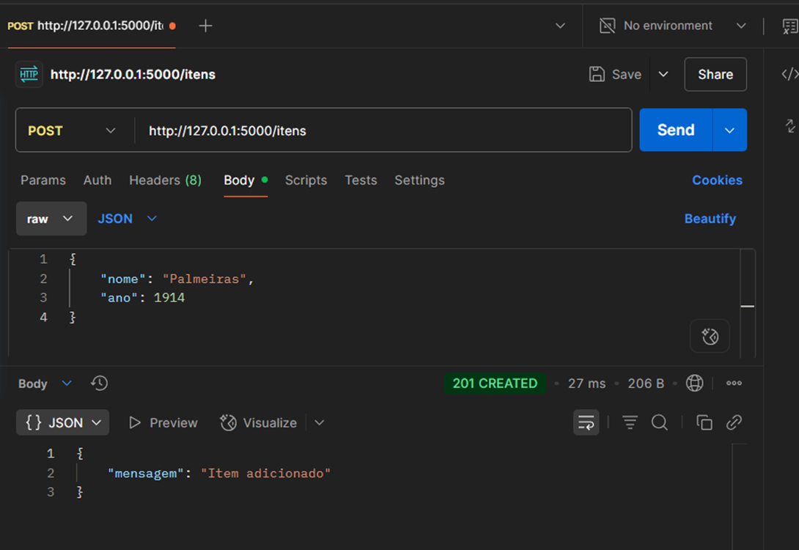
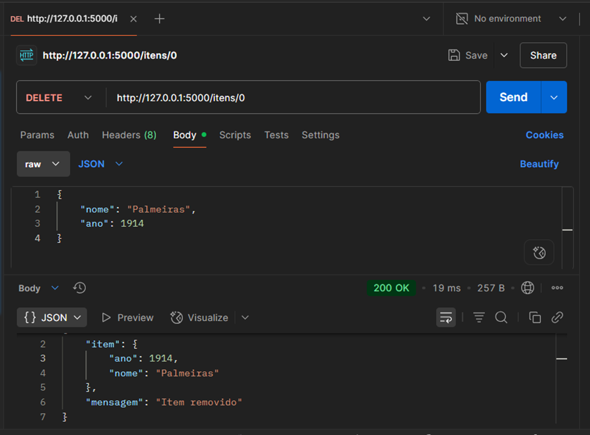
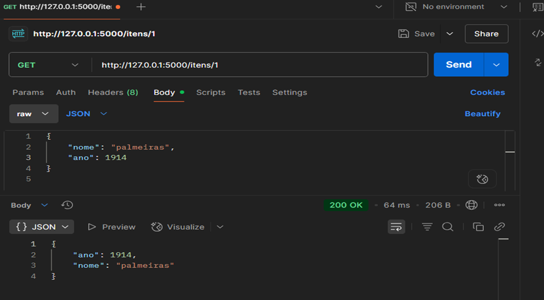

# 🐍 Projeto Flask + Python + Postman

Este projeto tem como objetivo criar uma API simples utilizando **Flask** e testá-la utilizando o **Postman**, implementando os métodos **GET**, **POST**, **DELETE** e posteriormente **GET por índice**.

---

## ⚙️ Requisitos Iniciais

### 1. Instalar o Python

- Faça o download no [site oficial do Python](https://www.python.org/).
- Durante a instalação, **marque a opção “Add Python to PATH”**.
- Para verificar se está instalado corretamente, rode:

```bash
python --version
```
## 2. Instalar o VS Code
Baixe no site oficial do VS Code.

Marque as opções:

    “Add to PATH” e “Code na linha de comando”

### 3. Extensões do VS Code para este projeto
✅ Python (by Microsoft) – opcional, o projeto funciona sem ela

✅ Flask Snippets – fornece atalhos úteis (opcional)

✅ REST Client – permite testar APIs direto no VS Code

# 🛠️ Criando o Projeto
### 4. Criar a Pasta do Projeto
    mkdir novoProjetoFlask
    cd novoProjetoFlask

### 5. Criar Ambiente Virtual
```bash
python -m venv venv
```
    
#### Ativar o ambiente virtual:

```bash
venv\Scripts\activate
```
- Se ativado, aparecerá no terminal (venv) antes da linha de comando.

#### Caso ocorra erro de segurança no PowerShell:🔓 Liberar execução de scripts:
- Abra o PowerShell como administrador

- Verifique a política atual (opcional):

```bash
Get-ExecutionPolicy
```
- Altere a política:

```bash
Set-ExecutionPolicy RemoteSigned -Scope CurrentUser
```
- Confirme com S e Enter

- Ative novamente o ambiente virtual:

```bash
.\venv\Scripts\Activate.ps1
ou
venv\Scripts\activate 
```

### 6. Instalar o Flask
```bash
pip install flask
```
### 7. 💻 Criando o app.py
Crie o arquivo app.py com o seguinte conteúdo:
```
python
from flask import Flask, request, jsonify

app = Flask(__name__)
dados = []

@app.route('/itens', methods=['GET'])
def listar_itens():
    return jsonify(dados)

@app.route('/itens', methods=['POST'])
def adicionar_item():
    item = request.json
    dados.append(item)
    return jsonify({'mensagem': 'Item adicionado'}), 201

@app.route('/itens/<int:indice>', methods=['DELETE'])
def deletar_item(indice):
    if 0 <= indice < len(dados):
        removido = dados.pop(indice)
        return jsonify({'mensagem': 'Item removido', 'item': removido})
    return jsonify({'erro': 'Índice inválido'}), 400

# buscar somente um item da lista
@app.route('/itens/<int:indice>', methods=['GET'])
def obter_item(indice):
    if 0 <= indice < len(dados):
        return jsonify(dados[indice])
    return jsonify({'erro': 'Índice inválido'}), 404

if __name__ == '__main__':
    app.run(debug=True)

```
### 8. ▶️ Rodando o Projeto
No terminal do VS Code:
```
bash
python app.py
```
- O terminal mostrará:
Running on http://127.0.0.1:5000
Acesse http://127.0.0.1:5000/itens para ver um JSON vazio.

### 9.📬 Testando com o Postman
#### 🔹 Método GET
Acesse: http://127.0.0.1:5000/itens

Use raw e JSON como formato da resposta


#### 🔹 Método POST
Endpoint: http://127.0.0.1:5000/itens

Aba: Body > raw > JSON


#### 🔹 Método DELETE
Endpoint: http://127.0.0.1:5000/itens/0

Remove o item no índice especificado


#### 🔹 Buscar item específico (GET por índice)
Endpoint: http://127.0.0.1:5000/itens/0
- Devemos criar um nova rota.
```
@app.route('/itens/<int:indice>', methods=['GET'])
def obter_item(indice):
    if 0 <= indice < len(dados):
        return jsonify(dados[indice])
    return jsonify({'erro': 'Índice inválido'}), 404
```



🧠 Conclusão
Este projeto mostra uma API simples com Python e Flask, demonstrando os principais métodos REST. Ideal para quem está começando no desenvolvimento de back-end e quer entender o ciclo de criação e teste de uma API.